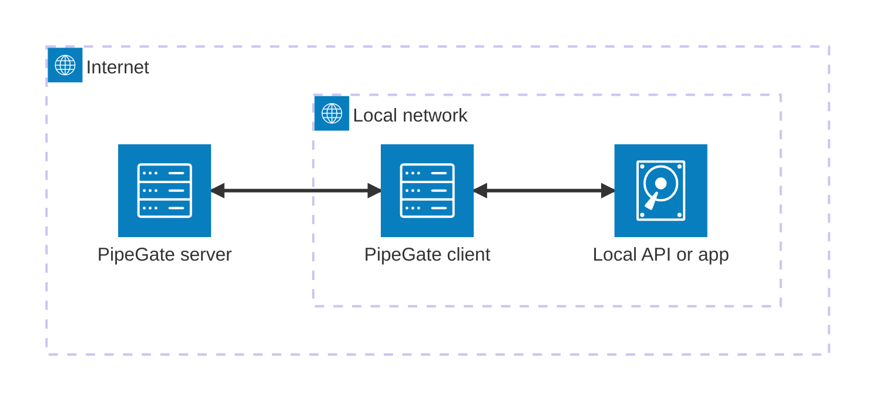

# PipeGate

PipeGate is a lightweight, self-hosted proxy built with FastAPI, designed as a "poor man's ngrok." It allows you to expose your local servers to the internet, providing a simple way to create tunnels from your local machine to the external world.

This is a fork of the original implementation at [janbjorge/pipegate](https://github.com/janbjorge/pipegate) that is more suited to my personal needs.

Most notably, the server requires a token to be passed and verified in the connection handshake before the websocket is accepted. This ensures that only clients that know the token that the server is checking against can connect and tunnel content through an endpoint.

## Setup

### Requirements

- Python 3.12
- Git

### Installation

```
git clone https://github.com/brandongregoryscott/pipegate
cd pipegate
python3 -m venv venv
venv/bin/pip install --ignore-requires-python git+https://github.com/brandongregoryscott/pipegate
```

### Server setup

The server should be publicly accessible, ideally with a domain name to easily remember and reference.

1. Install PipeGate
1. Choose or generate an authentication token. This token is used to verify that the PipeGate client connecting to the PipeGate server is authorized to do so, i.e. it is used as a password to prevent random people from attempting to serve arbitrary content through your server.
1. Start the server, which will listen for websocket connections from PipeGate clients and requests from external users.

```sh
venv/bin/python -m pipegate.server --client-token 123xyz...
```

#### SSL / Serving requests over HTTPS

In order for PipeGate clients to connect over `wss://` (and thus, let external consumers or clients of your app/API to make requests over an `https://` connection), your PipeGate server will need to have a valid SSL certificate.

You can generate your own SSL certificate with [Certbot](https://certbot.eff.org/) very easily. It has a setup guide that is tailored to your specific setup, but I was able to get it working by selecting _My HTTP website is running OTHER on Linux (snap)_ and following the provided instructions.

Once you have an SSL certificate and key, you can pass the paths to those files when running the PipeGate server, and clients will be able to use `wss://` instead of `ws://` when specifying the server URL.

```sh
venv/bin/python -m pipegate.server --client-token 123xyz... --ssl-keyfile /etc/foo/privkey.pem --ssl-certfile /etc/foo/fullchain.pem
```

### Client setup

The client should be run on the same machine as the local application or API you're trying to expose.

1. Install PipeGate
1. Start your local application or API.
1. Start the PipeGate client with the same token your server is verifying against, the local server URL and the PipeGate server URL.
   1. The PipeGate server URL needs to include a `ws://` or `wss://` protocol because the PipeGate server and client communicate over a websocket connection.

```sh
venv/bin/python -m pipegate.client --local-url <local server url> --server-url <PipeGate server url with a websocket protocol> --client-token <token for authenticating with the PipeGate server>

```

For example, if I have a Node JS API running on port 5001, and my PipeGate server is available at the domain fooserver.com, I would run this command to start the client:

```sh
venv/bin/python -m pipegate.client --local-url http://localhost:5001 --server-url wss://fooserver.com/node --client-token 123xyz...
```

Now, if I want to hit the `/articles` endpoint on my NodeJS server, I can make a request to `https://fooserver.com/node/articles`.

## Architecture

Similar to [Ngrok](https://ngrok.com/), PipeGate acts as a tunnel that forwards requests from clients to an application on your local machine using an intermediary server.


